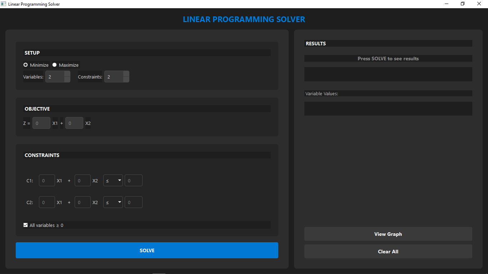
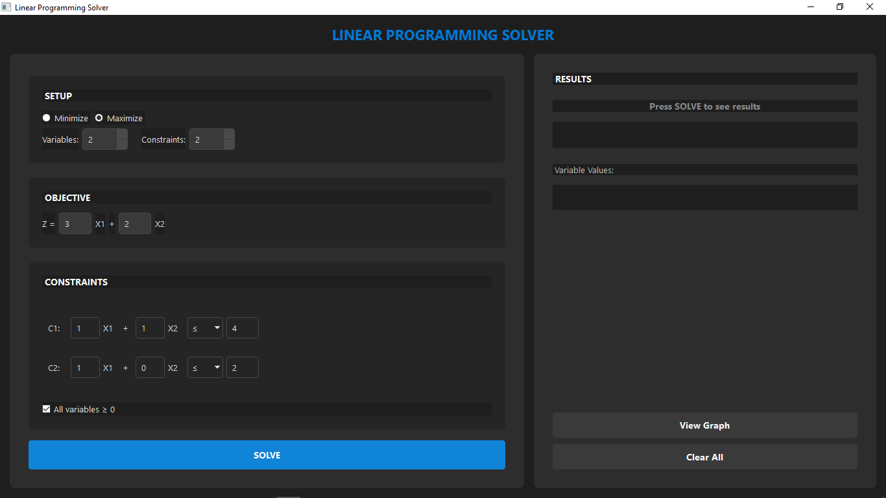
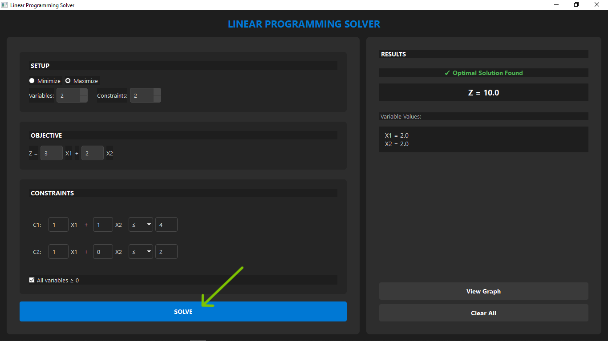
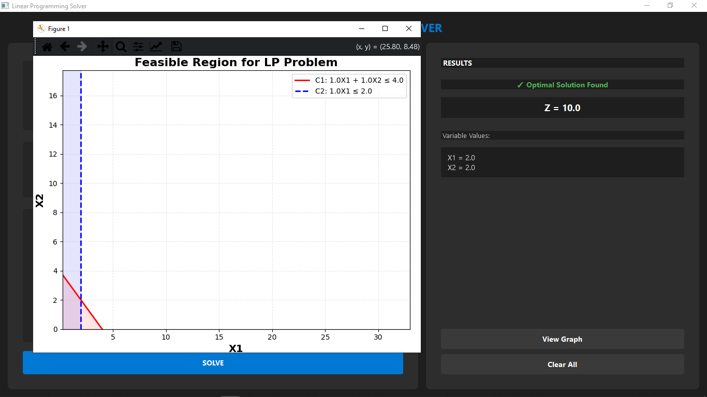
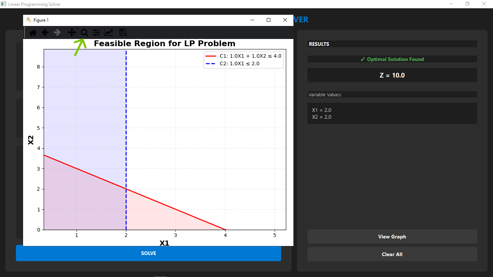
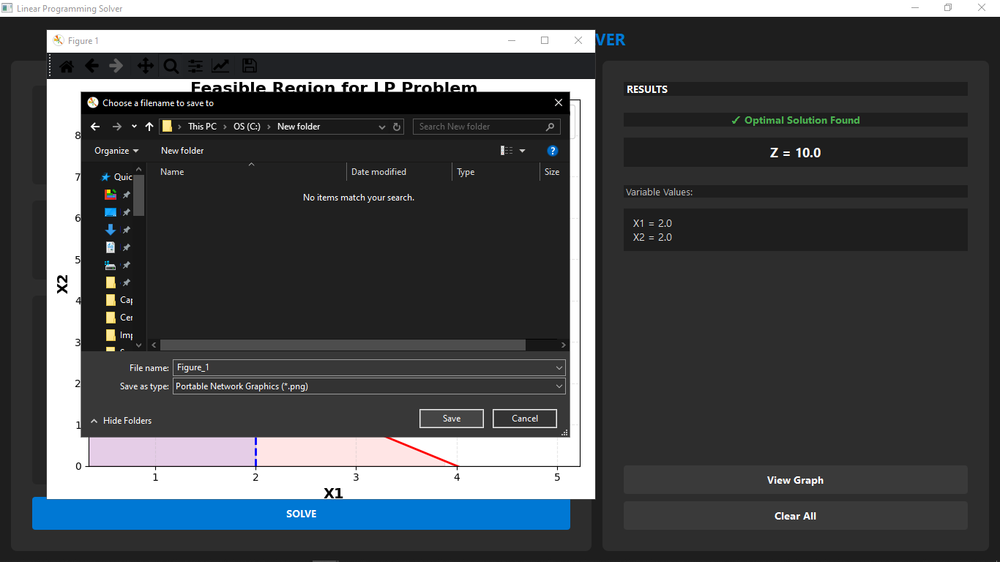

# Linear Programming Solver

Linear programming is a method for finding the best possible outcome when working with limited resources. It is a key tool in operations research, helping to optimize resource allocation and achieve the most efficient solutions. Real-world problems often involve limited resources, and linear programming helps determine the optimal way to use them.  

This application was built to make that concept easier to explore by letting users define objectives, apply constraints, and instantly see optimal solutions, with graphical visualization available for two-variable cases. It can be applied to production planning, resource allocation, scheduling, and many other scenarios where making the best decisions with limited resources is crucial.


## Features

- Easy-to-use interface to define objectives and constraints.
- Solve linear programming problems with multiple variables and constraints.
- Supports both minimization and maximization objectives.
- Automatic handling of non-negativity constraints (all variables ≥ 0).
- Graphical visualization of feasible regions for 2-variable problems.
- Clear display of optimal values and variable assignments.
- Export feasible region graphs as PNG images.
- Handles infeasible or unbounded problems gracefully.
- Dark-themed, modern GUI for better user experience.

## Installation

### Requirements

Python 3.9 or higher and the following libraries:

- `PySide6`
- `PuLP`
- `matplotlib`
- `numpy`

You can install them all at once using:

```bash
pip install -r requirements.txt
```

### Clone the repository

```bash
git clone https://github.com/Cs-Jimmy/Linear-Programming-Solver.git
```

### Navigate into the project folder

```bash
cd Linear-Programming-Solver
```

### Run the application
```bash
python main.py
```
## Project Structure
```
Linear-Programming-Solver/
│
├── main.py
├── gui.py
├── solver.py
├── plotter.py
├── style.qss
├── requirements.txt
├── screenshots/
├── .gitignore
└── README.md
```

## Usage Example

**Scenario:** Factory produces Chairs (X1) and Tables (X2)

| Element | Details |
|---------|---------|
| **Objective** | Maximize Z = 40X1 + 70X2 |
| **Constraints** | 2X1 + 3X2 ≤ 100 (Wood)<br>1X1 + 2X2 ≤ 80 (Labor)<br>X1, X2 ≥ 0 |
| **Solution** | Z = 1600, X1 = 20, X2 = 20 |

**Result:** Produce **20 Chairs** and **20 Tables** for maximum profit. Click **View Graph** to visualize the feasible region.

## Demo

1. **Initial Setup**  
     
   Default interface: 2 variables, 2 constraints, empty fields.

2. **Problem Configuration**  
     
   Sample LP problem entered: objective function and constraints ready to solve.

3. **Solution Results**  
     
   Shows optimal Z value and variable values after solving.

4. **Feasible Region Graph (Wide)**  
     
   Full feasible region with all constraint lines.

5. **Feasible Region Graph (Zoomed)**  
     
   Zoomed view highlighting the optimal solution point.

6. **Save Graph Feature**  
     
   Exporting the feasible region graph as an image.  


